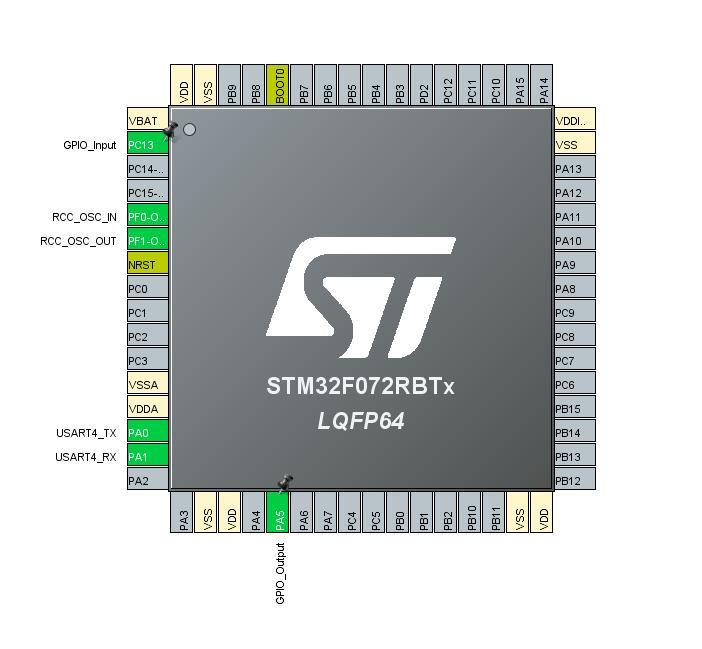
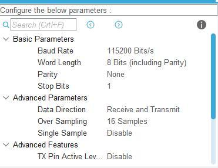
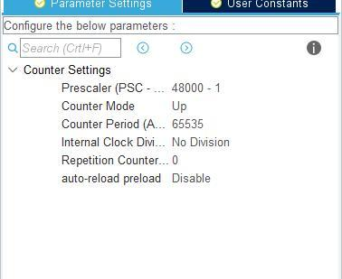

# NUCLEO F072RB
Measuring time of pressing button (seconds) and sending result to terminal through UART.

# Requirements
* NUCLEO F072RB
* UART-USB (for example FTDI232)
* STM32CUBEMX
* Keil Vision (MDK-ARM > v5.27)

# Configurations

* USART4

  - BaundRate: __115100 bit/sec__
* TIM16

  - Prescaler: __48000- 1__ (that's mean, that 48MHz divide on 48000 and we get T=1000, so one tick=0,001sec)
* PC13
  - GPIO_OUTPUT

# Compilation
In Keil Vision, open project.
Go to _Project->Options->Add Erase Flash_

After it Compile, Debug and Load to Flash.

# UART-USB
Set 5.0V on UART board,
Connect PA_0 and RX pin on UART board and GND.
Connect UART board to your PC, open Terminal (TeraTerm, for example).
Connect to COM port of UART board, set 115200 bauds/sec.

__Press button more than 1 sec.__
